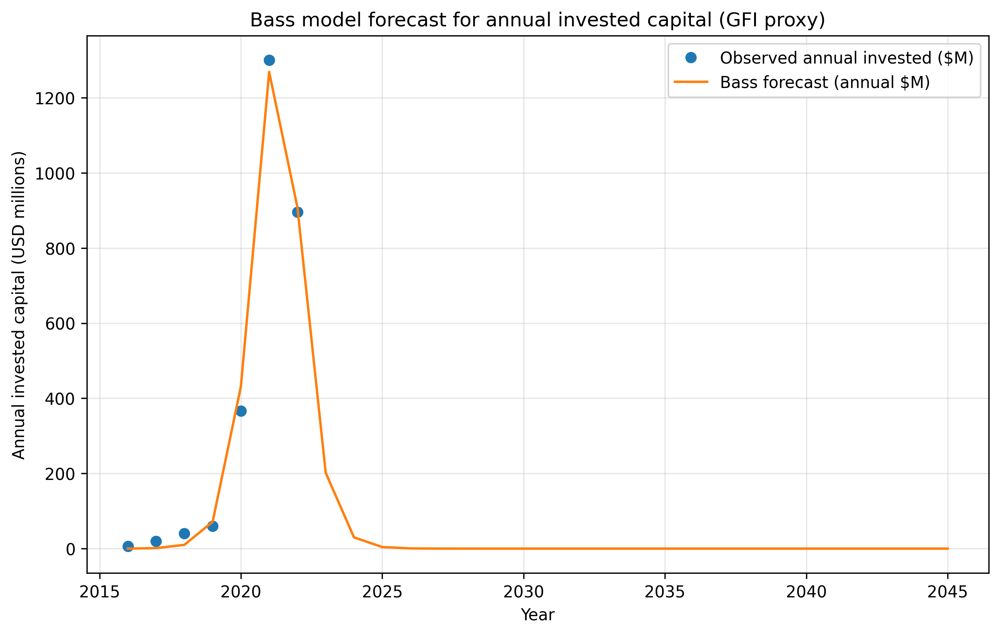

# Innovation Diffusion Analysis
---

## 1. Selected Innovation  

Meatable’s Opti-Ox is a an innovation in lab grown meat technology that allows the rapid growth of stem cells into real muscle and fat in only four days. This process enables the production of lab grown pork without harming animals and the enviornment. By optimizing the cell type, Opti-Ox makes scalable lab grown meat production faster, more consistent, and more cost-efficient than previous methods.

---

## 2. Similar Innovation from the Past  

Believer Meats mainly focused on reducing the cost of making lab grown meat products, focusing on growing animal cells in nutrient-rich bioreactors without genetic modification. They focus on producing chicken meat and they have one of the lowest manufacturing costs of about 16$ per pound.

### Comparison

Both Meatable and Believer Meats share the goal of creating ethical, sustainable meat through stem cells, yet they differ in their approach and efficiency. Believer Meats laid the groundwork for industrial-scale cultivated meat by proving that animal cells could be grown efficiently and safely. Their innovation demonstrated that large-scale cell cultivation could produce real meat textures and flavors, setting the stage for the current wave of commercial interest in cultured meat.

Meatables Opti-Ox builds on that foundation by improving cell conversion speed and process precision. While Believer Meats’ fibroblast-based system required several weeks to generate mature tissue, Meatable’s technology achieves full differentiation in only days. This represents a major leap cost efficiency, positioning Meatables process as a viable buisness model. In essence, Believer Meats started the business of commercial lab grown meat, and Meatables Opti-Ox refines that path with better technology in order to possition themselves better in the market.

---

## 3. Historical data
Since i could not find data on adoption rate i will use the annual investment data in alternative meats as my alternative. The link where i got the data is in the references it's figure 6 in the pdf.

---

## 4. Estimate Bass Model parameters.
From my estimation i got that p = 0.00015, q = 1.99, M = 2927 (Million USD). This means that we have very low adopton rate and very high limitation rate. And with peak at 2927 Million USD which was reaced at 2021. This happened mostly due to the limited data i have, since in my data we got the peak in 2021 and got a decline in 2022, the Bass Model predicts that it will continue going down rapidly and reach almost 0 at 2025-2026. 

---

## 5. Prediction of the diffusion

From my analysis we get:

1. Introduction (2016-2019)
- Minimal annual investment: $6M → $60M
- Very few early adopters

2. Rapid Growth Phase (2020-2021)
- Explosive growth: $366M (2020) → $1,300M (2021)
- Most likely investors following other investors because of FOMO
- Peak annual investment in 2021 at $1,300M

3. Market Saturation & Decline (2022-present)
- Sharp drop to $896M (2022)
- Declining interest in the technology

---

## 6. Choosing a scope
For the scope i will go with global since most of the papers i found did research mostly globally. There are some research papers on Singapore, but the best data i found was global and it's more interesting to understand how globally the world is reacting to lab grown meat.

---

## 7. Estimate the number of adopters by period.
From my estimations that i got the interest already died down and the decline in investment will countinue to deacrease as is in the graph.

The full data can be found at the investment_forecast_with_conversions where i estimate that for each 7000$ invested we get one conversion. It's steep because the adoption rate is very low and with the price of normal meat being still significantly cheaper the adoption won't go mainstream and most people will most likely not regurally use this product. If the price does not significantly go down from about 14$ per pound to about 4-6$(Which is the price of normal meat) the product will not gain mass adoption.

---

## References  
- Annual investment data: [https://gfi.org/wp-content/uploads/2023/01/2022-Cultivated-Meat-State-of-the-Industry-Report.pdf](https://gfi.org/wp-content/uploads/2023/01/2022-Cultivated-Meat-State-of-the-Industry-Report.pdf)  
- Believer Meats: [https://www.believermeats.com/](https://www.believermeats.com/)  
- Coverage on cultivated meat innovations: [Reuters — Believer Meats to build largest cultivated meat facility](https://www.reuters.com/business/retail-consumer/believer-meats-build-largest-cultivated-meat-facility-us-2022-12-07/)
